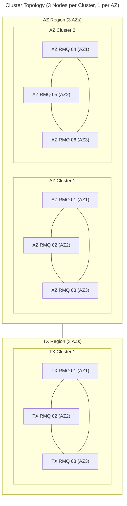
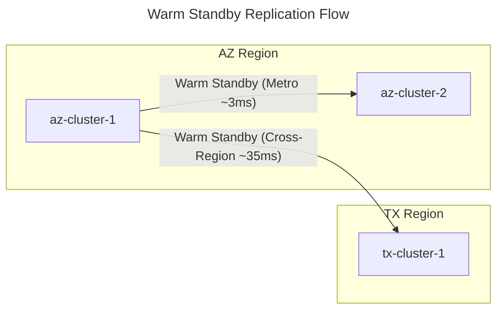

# Tanzu RabbitMQ Ansible Lab (Static Inventory)

Automated deployment of a Tanzu RabbitMQ multi-region lab environment using **existing machines** with:

- **3 Clusters** across 2 regions (Arizona + Texas):
  - **Arizona:** 2 Clusters (az-cluster-1, az-cluster-2), each with 3 nodes (1 per AZ)
  - **Texas:** 1 Cluster (tx-cluster-1), with 3 nodes (1 per AZ)
- **Network Latency Simulation**: Metro (~3ms) within regions, cross-region (~35ms) between Arizona and Texas
- **Warm Standby DR**: AZ-Cluster-1 replicates to AZ-Cluster-2 (regional standby) and TX-Cluster-1 (cross-region DR)
- **9 Nodes Total**: 6 in Arizona, 3 in Texas

## Architecture





## Prerequisites

- **Workstation (Controller):**
  - Python 3.9+ with Ansible
  - Access to nodes via SSH (key-based auth recommended)
  - RabbitMQ RPM in `bin/` directory (`tanzu-rabbitmq-server-4.2.3-1.el9.x86_64.rpm`)
- **Remote Nodes:**
  - RHEL/Rocky Linux 9.7
  - SSH access for Ansible user (e.g., `root`)
  - Internet access (or configured repos) for dependencies (`dnf install erlang`, `iproute-tc`)

## Quick Start

### 1. Install Ansible dependencies

```bash
pip install ansible
ansible-galaxy collection install -r requirements.yml
```

### 2. Prepare Binaries

Place the Tanzu RabbitMQ RPM in the `bin/` directory:
```
bin/tanzu-rabbitmq-server-4.2.3-1.el9.x86_64.rpm
```

### 3. Configure Inventory

Edit `inventory/hosts.yml` to set your **real IP addresses**:

```yaml
    az-cluster-1:
      hosts:
        az-rmq-01:
          ansible_host: 10.85.10.234 
```

### 4. Deploy

```bash
ansible-playbook site.yml
```

## Playbooks

| Playbook | Description |
|----------|-------------|
| `site.yml` | Master playbook - runs installation and configuration |
| `playbooks/install_rmq.yml` | Installs Erlang and RabbitMQ from local RPM |
| `playbooks/configure_latency.yml` | Setup network latency simulation (Metro/Cross-Region) |
| `playbooks/configure_warm_standby.yml` | Configure warm standby replication DR |
| `playbooks/uninstall.yml` | **Uninstall** RabbitMQ and revert configuration |
| `playbooks/health_check.yml` | Verify cluster health |

### Cleanup / Uninstall

To remove RabbitMQ and revert changes on the nodes:

```bash
ansible-playbook playbooks/uninstall.yml
```

## Management UIs

After deployment, access the Management UI on port 15672:

| Cluster | URL (Example IP) | Credentials |
|---------|-----|-------------|
| AZ-Cluster-1 | http://10.85.10.234:15672 | admin / (check vault or default) |
| AZ-Cluster-2 | http://110.85.10.241:15672 | admin / (check vault or default) |
| TX-Cluster-1 | http://10.85.10.244:15672 | admin / (check vault or default) |

## Testing Warm Standby Replication

1. Log into AZ-Cluster-1 management UI
2. Create a queue and publish messages
3. Log into AZ-Cluster-2 or TX-Cluster-1
4. Verify the queue and messages appear via warm standby replication
5. Check replication status: `rabbitmqctl standby_replication_status`

## Troubleshooting

### Health check
```bash
ansible-playbook playbooks/health_check.yml
```

### Manual cluster status
```bash
ansible az-rmq-01 -m command -a "rabbitmqctl cluster_status"
ansible az-rmq-04 -m command -a "rabbitmqctl cluster_status"
ansible tx-rmq-01 -m command -a "rabbitmqctl cluster_status"
```

### Verify latency simulation
```bash
# Metro latency within Arizona (~3ms)
ansible az-rmq-01 -m command -a "ping -c 3 az-rmq-02"

# Cross-region latency Arizona → Texas (~35ms)
ansible az-rmq-01 -m command -a "ping -c 3 tx-rmq-01"
```

### Reset admin password
```bash
# Reset on all cluster seeds
ansible az-rmq-01,az-rmq-04,tx-rmq-01 -m command -a "rabbitmqctl change_password admin newpassword"
```

### Re-run specific stage
```bash
# Re-configure federation
ansible-playbook playbooks/configure_warm_standby.yml
```

## Performance Testing

A test framework is included for validating throughput, latency, and replication under load. See [perf-tests/README.md](perf-tests/README.md) for full details.

```bash
# Install test tools
ansible-playbook playbooks/install_perftest.yml

# Run a baseline test against AZ-Cluster-1
./perf-tests/run-test.sh baseline --host 192.168.20.200

# Compare results
./perf-tests/compare-results.sh
```

## Customization

To adapt for your environment:

1. **Different IP range**: Edit `inventory/hosts.yml`
2. **Different latency values**: Edit `latency.*` in `inventory/group_vars/all/main.yml`
3. **Different cluster sizes**: Modify inventory groups and adjust playbooks
4. **Skip latency simulation**: Remove `configure_latency.yml` from `site.yml`

## Production Sizing

For guidance on running warm standby replication at high message rates (trading-adjacent and financial services workloads), see [High-Throughput Warm Standby Sizing Guide](docs/high-throughput-sizing.md). Covers fan-out architecture constraints, disk/network/WAN sizing, replication lag and RPO analysis, and operational procedures for multi-downstream failover.

## File Structure

```
.
├── ansible.cfg                 # Ansible configuration
├── site.yml                    # Master playbook
├── requirements.yml            # Ansible collection dependencies
├── inventory/
│   ├── hosts.yml              # 9-node inventory (3 clusters)
│   └── group_vars/all/
│       ├── main.yml           # Non-secret configuration
│       ├── vault.yml          # Encrypted secrets (not in git)
│       └── vault.yml.example  # Template for secrets
├── playbooks/
│   ├── install_rmq.yml        # RabbitMQ installation
│   ├── configure_latency.yml  # Network latency (metro + cross-region)
│   ├── configure_warm_standby.yml  # Warm standby replication DR
│   ├── health_check.yml       # Environment verification
│   ├── install_perftest.yml   # Performance test tools
│   └── uninstall.yml          # Cleanup / Revert
├── perf-tests/
│   ├── README.md              # Performance testing guide
│   ├── run-test.sh            # Test runner script
│   ├── compare-results.sh     # Results comparison
│   ├── scenarios/             # Test scenario definitions
│   ├── results/               # Test output (git-ignored)
│   └── tools/                 # Downloaded JARs (git-ignored)
├── bin/
│   └── tanzu-rabbitmq-server...rpm # Local RPM (git-ignored)
├── templates/
│   └── rabbitmq.conf.j2       # RabbitMQ configuration template
└── docs/
    └── high-throughput-sizing.md # Sizing guide
```
